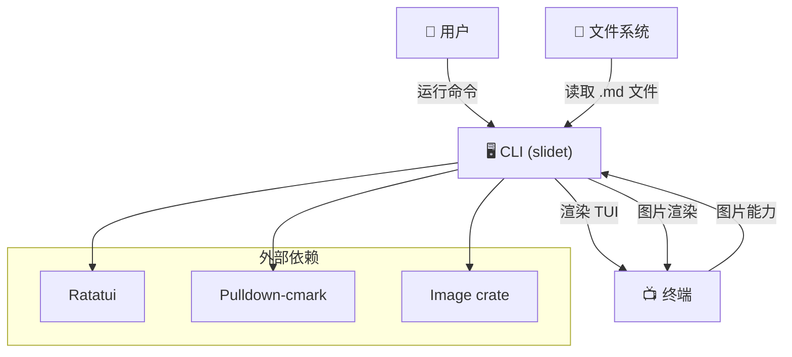

<!-- BEGIN:architecture -->

# slidet - 架构文档

## 项目概述

**问题域**: slidet 是一个终端 Markdown 幻灯片播放器，解决了在终端环境下演示 Markdown 幻灯片的需求，无需离开终端或依赖 GUI 应用。

**主要用户**:
- 需要在终端环境下演示内容的开发者
- 偏好 CLI 工具的讲师和技术演讲者
- 在无 GUI 环境下（如 SSH 会话）进行演示的用户

**核心价值**:
- 终端原生的幻灯片播放体验
- 支持图片渲染（在兼容终端中）
- 简单的目录组织方式（按文件名字典序）
- 两种交互模式：浏览和演示

## 技术栈

**编程语言**: Rust (Edition 2021)

**核心框架和库**:
- `ratatui` (0.29): 终端 UI 框架
- `crossterm` (0.28): 跨平台终端操作
- `pulldown-cmark` (0.12): Markdown 解析
- `clap` (4): 命令行参数解析
- `image` (0.25): 图片处理
- `ratatui-image` (4): 终端图片渲染
- `tui-markdown` (0.3.7): Markdown 到 TUI 组件转换
- `unicode-width` (0.2): Unicode 字符宽度计算

**构建工具**: Cargo

**运行环境**: 终端（支持图片渲染的终端如 Kitty, iTerm2, WezTerm, ghostty）

## 架构模式

**架构风格**: 单体 CLI 应用，模块化设计

**设计原则**:
- 职责清晰分离（loader / parser / state / render）
- Graceful degradation（图片能力降级）
- 终端生命周期成对管理（init / restore）

## 核心模块（一级）

| 模块 | 文件 | 职责 |
|------|------|------|
| **loader** | `src/loader.rs` | 扫描目录，加载 `.md` 文件，按文件名字典序排序 |
| **markdown** | `src/markdown.rs` | 将 Markdown 解析为 `Text` 和 `Image` 两类块，处理表格折叠 |
| **image** | `src/image.rs` | 检测终端图片能力，提供降级策略，处理 SVG 不支持场景 |
| **app** | `src/app.rs` | 应用状态、事件循环、按键处理、图片状态缓存 |
| **ui** | `src/ui.rs` | Browse/Present 两种视图渲染、文本滚动、图片渲染 |

## 关键路径

### 启动流

```
main.rs (CLI 入口)
  → Cli::parse() (解析命令行参数)
  → loader::load_slides() (加载幻灯片目录)
  → ui::init_terminal() (初始化终端)
  → app::run() (主事件循环)
    → terminal.draw() (渲染帧)
    → event::read() (读取事件)
    → app.handle_key() (处理按键)
  → ui::restore_terminal() (恢复终端)
```

### 主要使用场景：浏览模式导航

```
用户按 j/Down 键
  → app.rs:handle_key(KeyCode::Down)
    → app.next_slide()
      → selected += 1
      → scroll = 0
  → 下次渲染时显示新幻灯片
```

### 主要使用场景：进入演示模式

```
用户按 Enter 键
  → app.rs:handle_key(KeyCode::Enter)
    → mode = Mode::Present
    → scroll = 0
  → ui.rs:render_present()
    → 全屏渲染当前幻灯片内容
    → 支持 PageDown/PageUp 滚动
```

### 主要使用场景：图片渲染（降级路径）

```
Markdown 包含 
  → markdown.rs:parse_blocks() → SlideBlock::Image { src: "image.png" }
  → ui.rs:render_image_block()
    → image.rs:prepare_image()
      → 检查文件是否存在 → 不存在 → FallbackText: "[missing image]"
      → 检查是否为 SVG → 是 → FallbackText: "[svg unsupported]"
      → 检查终端是否支持图片 → 不支持 → FallbackText: "[image unavailable]"
      → 终端支持 → TerminalImage { path }
```

## 配置驱动的逻辑

### 环境变量

| 环境变量 | 影响 | 使用场景 |
|---------|------|---------|
| `KITTY_WINDOW_ID` | 启用 Kitty 终端图片渲染 | Kitty 终端用户 |
| `TERM_PROGRAM` | 检测终端类型 | 值为 `iTerm.app`, `WezTerm`, `ghostty` 时启用图片渲染 |

**检测逻辑** (image.rs):
```rust
pub fn terminal_supports_images() -> bool {
    std::env::var_os("KITTY_WINDOW_ID").is_some()
        || matches!(
            std::env::var("TERM_PROGRAM").as_deref(),
            Ok("iTerm.app") | Ok("WezTerm") | Ok("ghostty")
        )
}
```

### 配置文件

| 文件 | 用途 | 配置项 |
|------|------|--------|
| `Cargo.toml` | 项目依赖和构建配置 | 依赖版本、特性标志 |
| `.md` 文件 | 幻灯片内容 | Markdown 内容、图片引用 |

### 命令行参数

| 参数 | 类型 | 说明 |
|------|------|------|
| `slides_dir` | PathBuf | 幻灯片目录路径（必需） |

**示例**:
```bash
cargo run -- examples/01-text-lecture
```

## 系统上下文图



## 数据模型

### Slide (loader.rs)

```rust
pub struct Slide {
    pub path: PathBuf,           // 文件路径
    pub title: String,           // 文件名（不含扩展名）
    pub raw_markdown: String,    // 原始 Markdown 内容
}
```

### SlideBlock (markdown.rs)

```rust
pub enum SlideBlock {
    Markdown(String),              // Markdown 文本块
    Image { alt: String, src: String },  // 图片块
}
```

### App State (app.rs)

```rust
pub struct App {
    pub slides: Vec<Slide>,           // 所有幻灯片
    pub selected: usize,               // 当前选中索引
    pub mode: Mode,                    // Browse / Present
    pub scroll: u16,                   // 垂直滚动偏移
    pub should_quit: bool,             // 退出标志
    pub image_picker: Option<Picker>,  // 图片渲染器
    pub image_states: HashMap<PathBuf, StatefulProtocol>, // 图片状态缓存
}
```

### ImageRender (image.rs)

```rust
pub enum ImageRender {
    TerminalImage { path: PathBuf },   // 可渲染的图片
    FallbackText { message: String },  // 降级文本
}
```

## Markdown 处理流程

1. **加载**: `loader.rs` 读取 `.md` 文件原始内容
2. **解析**: `markdown.rs` 使用 `pulldown-cmark` 解析为 `SlideBlock` 序列
3. **预处理**: 表格折叠为卡片布局（适应终端宽度）
4. **渲染**: `ui.rs` 使用 `tui-markdown` 转换为 ratatui 组件

**表格降级示例**:
```
原始表格:
| Name | Role | Status |
| --- | --- | --- |
| Alice | Engineer | Active |

降级后:
> [table collapsed for terminal width]

**Row 1**
- Name: Alice
- Role: Engineer
- Status: Active
```

## 测试覆盖

每个模块都包含单元测试：

- **loader**: 测试目录扫描、排序、错误处理
- **markdown**: 测试块解析、表格折叠、标题提取
- **image**: 测试降级策略、终端检测
- **app**: 测试导航、模式切换、图片缓存
- **ui**: 测试渲染输出（使用 `TestBackend`）

运行测试：
```bash
cargo test
```

## 示例数据

项目包含 6 个示例目录（`examples/`）：

1. **01-text-lecture**: 纯文本演示
2. **02-image-demo**: 图片与降级演示
3. **03-engineering-notes**: 工程说明样例
4. **04-markdown-regression**: Markdown 回归样例
5. **05-parser-edge-cases**: 解析边界样例
6. **06-slide-navigation-story**: 导航故事样例

运行示例：
```bash
cargo run -- examples/01-text-lecture
```

## 性能考虑

- **图片缓存**: `App::image_states` 缓存已解码图片状态，避免重复解码
- **懒加载**: 图片仅在首次渲染时解码
- **终端恢复**: 确保异常退出后终端状态恢复（通过 `ratatui::restore()`）

## 已知限制

1. **SVG 不支持**: SVG 图片会降级为占位文本
2. **终端兼容性**: 仅支持 Kitty、iTerm2、WezTerm、ghostty 的图片渲染
3. **表格宽度**: 宽表格会被折叠为卡片布局
4. **滚动粒度**: 滚动以 5 行为单位（`PageDown`/`PageUp`）

## 未来扩展点

基于代码结构，以下扩展点较为清晰：

1. **新块类型**: 在 `markdown.rs` 中扩展 `SlideBlock` 枚举
2. **新渲染模式**: 在 `app.rs` 中扩展 `Mode` 枚举
3. **新终端支持**: 在 `image.rs` 中扩展 `terminal_supports_images()`
4. **新按键映射**: 在 `app.rs` 中扩展 `handle_key()`

<!-- END:architecture -->
