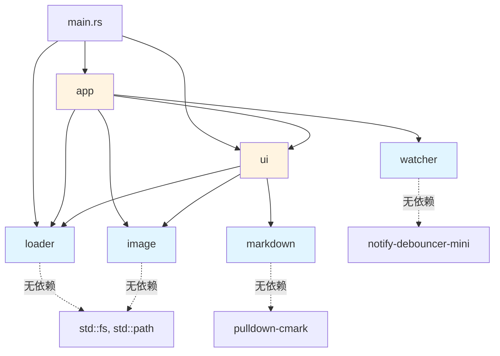

# slidet - 模块文档索引

## 项目简介

slidet 是一个终端 Markdown 幻灯片播放器，使用 Rust 编写，支持在终端环境下演示 Markdown 幻灯片，支持图片渲染（在兼容终端中）和 graceful fallback。

## 关键统计

- 第一级模块数: 6
- 总公开接口数: 28+
- 关键外部依赖: ratatui, pulldown-cmark, ratatui-image, image, notify-debouncer-mini

## 系统架构概览

三层架构：数据加载层（loader）→ 解析层（markdown, image）→ 状态管理层（app）→ 渲染层（ui）

<!-- BEGIN:module-index -->

## 模块索引

| 模块名 | 文档路径 | 主要责任 | 依赖模块 |
|--------|---------|---------|---------|
| loader | [loader.md](loader.md) | 扫描目录，加载 .md 文件，按文件名字典序排序 | 无（叶子模块） |
| markdown | [markdown.md](markdown.md) | 将 Markdown 解析为结构化块模型（SlideBlock/MarkdownBlock/InlineSpan） | 无（叶子模块） |
| image | [image.md](image.md) | 检测终端图片能力，提供降级策略 | 无（叶子模块） |
| app | [app.md](app.md) | 应用状态、事件循环、按键处理、图片状态缓存、热重载 | loader, ui, image, watcher |
| ui | [ui.md](ui.md) | Browse/Present 双模式渲染、文本滚动、图片渲染、重载指示器 | image, loader, markdown |
| watcher | [watcher.md](watcher.md) | 文件系统监控，检测 .md 文件变更触发热重载 | 无（叶子模块） |

<!-- END:module-index -->

<!-- BEGIN:dependency-graph -->

## 依赖关系图

**说明**:
- 蓝色节点（loader, markdown, image, watcher）：叶子模块，无内部依赖，可独立测试
- 黄色节点（app, ui）：状态管理和渲染模块，依赖叶子模块
- `app` 负责事件循环并构造 `RenderModel`，`ui` 仅消费渲染模型和图片状态接口
- loader、markdown、image、watcher 是纯函数/独立模块，易于测试和维护

<!-- END:dependency-graph -->

<!-- BEGIN:interface-index -->

## 全局接口索引

### loader 模块

| 接口 | 签名 | 说明 |
|------|------|------|
| `load_slides` | `fn(dir: &Path) -> Result<Vec<Slide>>` | 加载目录中所有 .md 文件 |
| `Slide` | `struct { path, title, raw_markdown }` | 幻灯片数据结构 |

### markdown 模块

| 接口 | 签名 | 说明 |
|------|------|------|
| `parse_blocks` | `fn(markdown: &str) -> Vec<SlideBlock>` | 解析 Markdown 为块序列 |
| `parse_markdown_blocks` | `fn(markdown: &str) -> Vec<MarkdownBlock>` | 解析为 MarkdownBlock 列表 |
| `extract_headings` | `fn(markdown: &str) -> Vec<String>` | 提取所有标题文本 |
| `preprocess_markdown` | `fn(markdown: &str, max_width: usize) -> String` | 预处理为纯文本，折叠表格 |
| `SlideBlock` | `enum { Markdown, Image }` | 顶层块类型 |
| `MarkdownBlock` | `enum { Heading, Paragraph, BulletList, ... }` | Markdown 内容块 |
| `InlineSpan` | `enum { Text, Strong, Emphasis, ... }` | 行内元素 |

### image 模块

| 接口 | 签名 | 说明 |
|------|------|------|
| `prepare_image` | `fn(base_dir: &Path, src: &str) -> Result<ImageRender>` | 准备图片渲染策略 |
| `terminal_supports_images` | `fn() -> bool` | 检测终端是否支持图片 |
| `ImageRender` | `enum { TerminalImage, FallbackText }` | 图片渲染策略 |

### app 模块

| 接口 | 签名 | 说明 |
|------|------|------|
| `run` | `fn(terminal: &mut DefaultTerminal, slides: Vec<Slide>, slides_dir: PathBuf) -> Result<()>` | 主事件循环（轮询模式，100ms 超时） |
| `App::new` | `fn(slides: Vec<Slide>, slides_dir: PathBuf) -> Self` | 创建 App 实例（含文件监控） |
| `App::current_slide` | `fn(&self) -> &Slide` | 获取当前幻灯片 |
| `App::next_slide` | `fn(&mut self)` | 切换到下一张 |
| `App::previous_slide` | `fn(&mut self)` | 切换到上一张 |
| `App::handle_key` | `fn(&mut self, code: KeyCode)` | 处理键盘事件 |
| `App::reload_slides` | `fn(&mut self)` | 从磁盘重新加载幻灯片，保持当前位置 |
| `App::image_state_for` | `fn(&mut self, path: &Path) -> Result<&mut StatefulProtocol>` | 获取图片渲染状态 |
| `Mode` | `enum { Browse, Present }` | 显示模式 |
| `App` | `struct { slides, selected, mode, scroll, should_quit, image, slides_dir, watcher, reload_indicator }` | 应用状态 |

### ui 模块

| 接口 | 签名 | 说明 |
|------|------|------|
| `init_terminal` | `fn() -> Result<DefaultTerminal>` | 初始化终端 |
| `restore_terminal` | `fn() -> Result<()>` | 恢复终端状态 |
| `render` | `fn(frame: &mut Frame, model: &RenderModel, image_states: &mut dyn ImageStateStore)` | 主渲染入口 |
| `render_reload_indicator` | `fn(frame: &mut Frame)` | 渲染"Reloaded"指示器（右下角，2秒后消失） |
| `render_slide_content` | `fn(base_dir: Option<&Path>, raw_markdown: &str) -> String` | 渲染为纯文本字符串 |

### watcher 模块

| 接口 | 签名 | 说明 |
|------|------|------|
| `SlideWatcher::new` | `fn(dir: &Path) -> Result<Self>` | 创建文件监控器 |
| `SlideWatcher::poll_changes` | `fn(&mut self) -> bool` | 非阻塞检查 .md 文件变更 |
| `SlideWatcher` | `struct { _debouncer, rx }` | 文件监控器（debounced，200ms） |

<!-- END:interface-index -->

<!-- BEGIN:cross-reference-check -->

## 交叉引用检查

### 依赖关系验证

| 模块 | 声称依赖 | 验证结果 |
|------|---------|---------|
| loader | 无 | ✅ 确认，仅依赖 std 和 anyhow |
| markdown | 无 | ✅ 确认，仅依赖 pulldown-cmark 和 std |
| image | 无 | ✅ 确认，仅依赖 std 和 anyhow |
| watcher | 无 | ✅ 确认，仅依赖 notify-debouncer-mini 和 std |
| app | loader, ui, image, watcher | ✅ 确认，使用 Slide、render()、terminal_supports_images()、SlideWatcher |
| ui | image, loader, markdown | ✅ 确认，使用 RenderModel/ImageStateStore 与图片、加载、Markdown 类型 |

### 循环依赖分析

✅ **未检测到循环依赖**

- `app` 调用 `ui::render()`
- `ui` 不再依赖 `app::App`，只依赖 `RenderModel` 和 `ImageStateStore`

**影响**: UI 现在只消费只读渲染模型和图片状态接口，模块边界更清晰，后续替换渲染器或扩展状态来源更容易。

### 孤立模块检查

✅ **无孤立模块**: 所有模块都被 main.rs 或其他模块使用。

<!-- END:cross-reference-check -->

## 质量门槛检查

- ✅ 模块索引表完整（列出所有 6 个模块和主要职责）
- ✅ 依赖关系图清晰且准确（Mermaid 格式）
- ✅ 全局接口索引覆盖 100% 公开接口
- ✅ 交叉引用检查完成，确认已无循环依赖
- ✅ YAML frontmatter 完整
